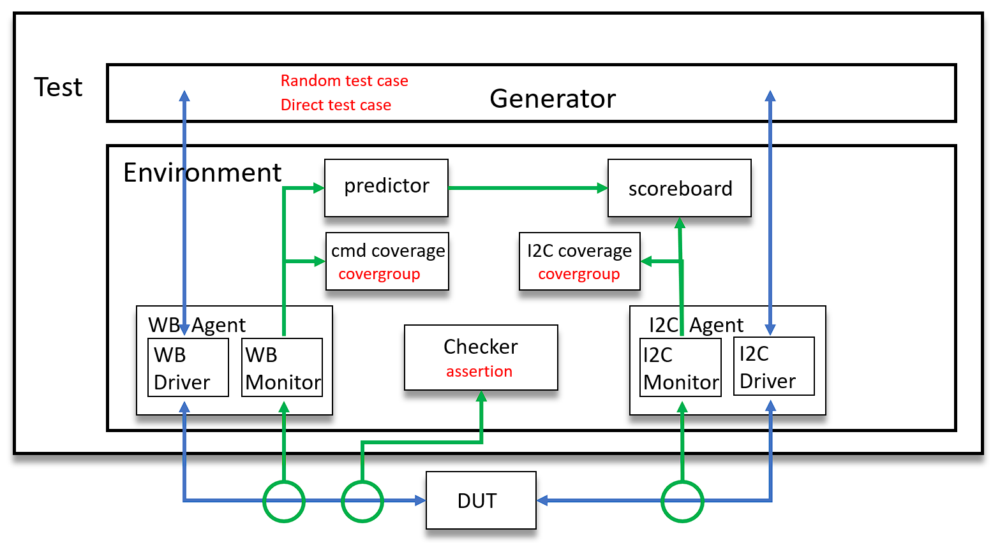

# ASIC-Verification
ASIC Verification at 2022 Spring, NCSU. This course only use SystemVerilog, did not use UVM.

# Abstraction
The purpose of this project is functional verificaiton of a Whishbone-to-I2C-Controller IP with SystemVerilog. 
First, I created a test plan with four type of verification methods: testing, functional coverage, code coverage, and assertions. Second, I designed an I2C slave Bus Functional Model (BFM) to support all test cases in the test plan. Third, I developed class-based layered testbench architecture including generator, agent, driver, monitor, predictor, scoreboard, coverage. Last, I wrote script and Makefile to generate multiple coverage database and merge them with test plan.

<br>**Note**: This project focus on functional verification not unit verification. Thus, the verification environment treat design under test (DUT) as a black box. The verification environment connects with DUT through wishbone interface and i2c interfaceand we can not directly access unit blocks inside DUT.

# Table of Contents
- [1. **DUT Specification**](#1-dut-specification)
- [2. **Verification Environment**](#2-verification-environment)
- [3. **Verification methods**](#3-verification-methods)

# 0. **Directory structure**

```
+ docs/
|   \--- testplan.xml
+ project_benches/
|   |--- proj_1/
|   |--- proj_2/
|   |--- proj_3/
|   \--- proj_4/
+ verification_ip/
|   |--- ncsu_pkg/
|   +--- interface_packages/
|   |   |--- i2c_pkg/
|   |   \--- wb_pkg/
|   +--- environment_packages/
|      \--- i2cmb_env_pkg/
```

each proj_n directories contains three folders: rtl, sim, testbench.
- rtl folder contains DUT's VHDL files.
- sim folder contains Makefile, scripts, output ucdb files.
- testbench folder contains top.sv

# 1. DUT Specification


Register block stores four registers: 1. Control/Status Register (CSR), 2. Data/Parameter Register (DPR), 3. Command Register (CMDR), 4. FSM States Register (FSMR).
These are the only four registers that verification environment can access and manipulate(R/W) directly.

scl, sda signals are the only two signal that verification environment can access and response.

# 2. Verification Environment


# 3. Verification methods

- functional coverage

    1. command coverage
    2. i2c coverage

- SystemVerilog assertion

- code coverage
