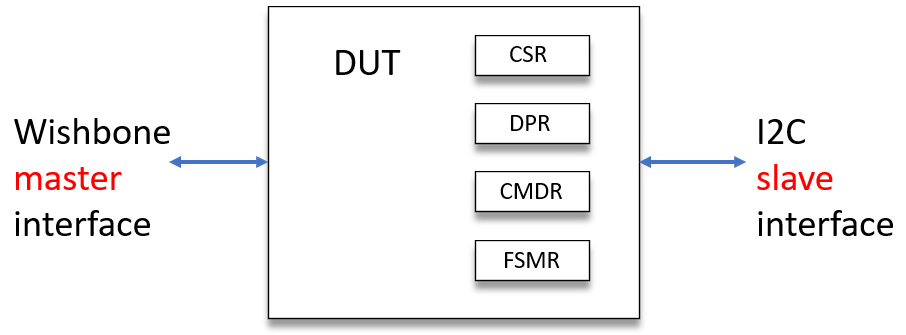

# ASIC-Verification
ASIC Verification at 2022 Spring, NCSU. This course only use SystemVerilog, did not use UVM.

# Abstraction
The purpose of this project is functional verificaiton of a Whishbone-to-I2C-Controller IP with SystemVerilog. 
First, I created a test plan with four type of verification methods: testing, functional coverage, code coverage, and assertions. Second, I designed an I2C slave Bus Functional Model (BFM) to support all test cases in the test plan. Third, I developed class-based layered testbench architecture including generator, agent, driver, monitor, predictor, scoreboard, coverage. Last, I wrote script and Makefile to generate multiple coverage database and merge them with test plan.

<br>**Note**: This project focus on functional verification not unit verification. Thus, the verification environment treat design under test (DUT) as a black box. The verification environment connects with DUT through wishbone interface and i2c interfaceand we can not directly access unit blocks inside DUT.

# Table of Contents
- [1. **DUT Specification**](#1-dut-specification)
- [2. **Verification Environment**](#2-verification-environment)
- [3. **Verification methods**](#3-verification-methods)

# 0. **Directory structure**

```
+ docs/
|   \--- testplan.xml
+ project_benches/
|   |--- proj_1/
|   |--- proj_2/
|   |--- proj_3/
|   \--- proj_4/
+ verification_ip/
|   |--- ncsu_pkg/
|   +--- interface_packages/
|   |   |--- i2c_pkg/
|   |   \--- wb_pkg/
|   +--- environment_packages/
|   |   \--- i2cmb_env_pkg/
```

Each proj_n directories contains three folders: rtl, sim, testbench.
- rtl folder contains DUT's VHDL files.
- sim folder contains Makefile, scripts, output ucdb files.
- testbench folder contains top.sv

# 1. DUT Specification 


Figure 1. DUT Specification  from IP user's view point

DUT owns four registers: 1. Control/Status Register (CSR), 2. Data/Parameter Register (DPR), 3. Command Register (CMDR), 4. FSM States Register (FSMR).
These are the only four registers that verification environment can access and manipulate(R/W) directly.

scl, sda signals are the only two signal that verification environment can access and response.

For detail explanation of iicmb controller's feature and control command, please refer to **docs/iicmb_spec.pdf**

# 2. Verification Environment


# 3. Verification methods

3.1. functional coverage
    3.1.1. wisbone covergroup:
        - auto defined bins: 4 types of wb_address, 2 types of wishbone operation(r/w) 
        - cross bins: wb_addrXop
    3.1.2. CSR covergroup:
        - user-defined state bins:  5 types of csr feature bits
    3.1.3. DPR covergroup:
        - user-defined state bins: 3 groups of dpr register value
    3.1.4. CMDR covergroup:
        - user-defined state bins: 4 types of cmdr feature bits, 6 types of commands
        - transition bins: 25 types of command transition

    3.1.5. i2c covergroup
        - auto defined bins: 2 types of i2c operations
        - user-defined state bins: 4 groups of i2c address, 4 groups of i2c data value, 3 groups of i2c transfer byte numbers(transSize)
        - cross bins: i2c_addrXop, i2c_addrXtransSize, i2c_opXtransSize

3.2. SystemVerilog assertion
    3.2.1. irq signal should never be asserted if interrupt is disabled.
    3.2.2. cmdr reserved bit should never be asserted.
    3.2.3. dut should never execute undefined command.
    3.2.4. byte finite state machine state should never be undefined state.
    3.2.5. bit finite state machine state should never be undefined state.

3.3. code coverage
    3.3.1. make sure each statement and condition in finite state machine has executed.

3.4. direct test case
    3.4.1. register reset test: ensure system can reset
    3.4.2. register default value test: ensure registers' default value is correct after reset.
    3.4.3. register aliasing test: ensure R/W to one register doesn't affect other registers.
    3.4.4. slave bus busy and capture test: ensure bus state bits works correctly before and after freed.
    3.4.5. slave bus ID set up test: ensure invalid bus ID failed, valid bus ID success.
    3.4.6. illegal command transition test: ensure FSM state transfer correctly if command transite illegally.
    3.4.7. arbitration lost test: ensure DUT can detect slave arbitration lost.
    3.4.8. no acknowledge test: ensure DUT can detect slave doesn't acknowledge.